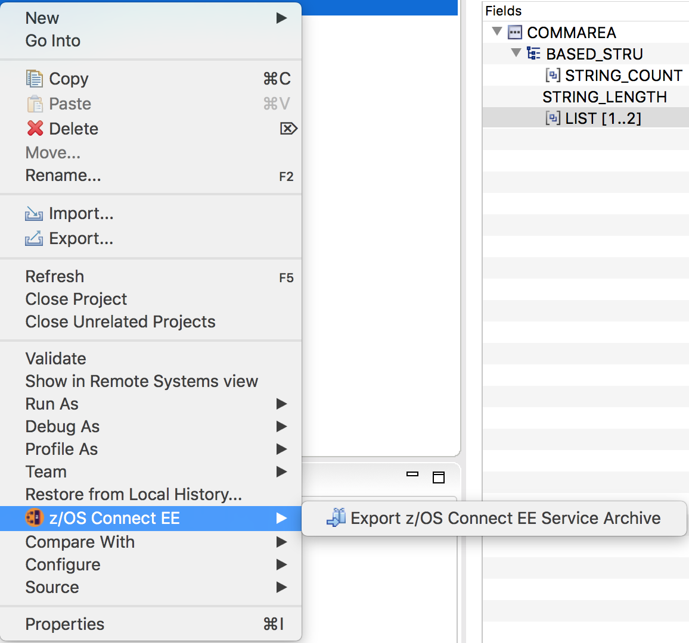

# Service Archive Files

A z/OS Connect service is the way that system of record assets are made available to be called from a RESTful API. Each service is described by a SAR file which can be used to build the API and deployed to the server to install and manage the service.

## Creating a service

The z/OS Connect EE API toolkit V3 has support for building service projects (in a similar way to API projects) based on the copybooks that describe the inputs and outputs to the CICS or IMS program.

Some example projects are available in the [Service Samples](./Service%20Samples) directory.

## Creating a SAR file

The SAR file can be created from these service projects by selecting the `Export z/OS Connect EE Service Archive` menu option from the project context menu.

## Further Information

More information about creating service projects and service archive files can be found in the [Knowledge Center](https://www.ibm.com/support/knowledgecenter/SS4SVW_3.0.0/com.ibm.zosconnect.doc/welcome/WelcomePage.html)